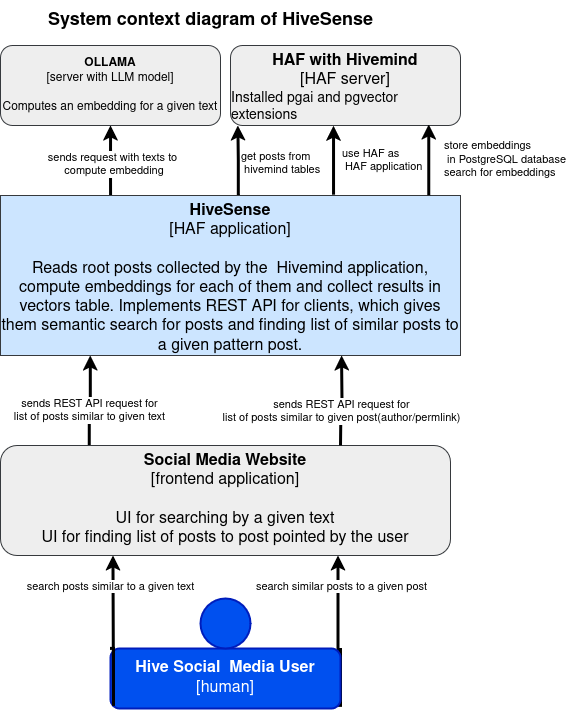
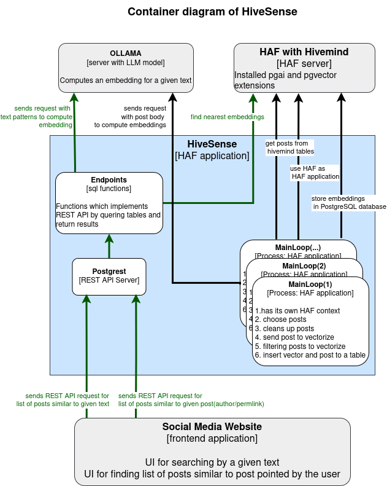

# HiveSense

HiveSense is a HAF-based application designed to enable **semantic search** among posts
on the Hive blockchain. It leverages **machine learning embeddings** to provide a
powerful and efficient way to find related content based on meaning rather than exact
keywords. The system integrates with [**Hivemind**](https://gitlab.syncad.com/hive/hivemind), a structured SQL-based database
layer for Hive social media data, to collect root posts, compute embeddings, and store
them in a **PostgreSQL vector database**. Through a **REST API**, HiveSense allows
clients to search for posts similar to a given text or retrieve posts similar to a
specific existing post. This enhances content discovery and engagement within the Hive
ecosystem.

## Software Architecture

### Dependencies

Ubuntu
Docker

```bash
sudo apt-get install postgresql-plpython3-17 postgresql-17-pgvector
```

#### External containers

1. [HAF](https://gitlab.syncad.com/hive/haf) server includes
    - [**Hivemind**](https://gitlab.syncad.com/hive/hivemind)
    - [pgai](https://github.com/Postgres-artificialintelligence/PGAI)
    - [pgvector](https://github.com/pgvector/pgvector)
2. [OLLAMA server](https://github.com/ollama/ollama)

### System context diagram





### Structure of sources

| **Directory Structure** | **Description**                                                          |
| ----------------------- | ------------------------------------------------------------------------ |
| **db/**                 | SQL code: schema definitions, runtime plpgsql code, HAF application code |
| **doc/**                | Resources for documentation                                              |
| **docker/**             | Scripts for docker container                                             |
| **endpoints/**          | REST API definitions                                                     |
| **scripts/**            | shell scripts                                                            |
| **submodules/**         | git submodules                                                           |
| **tests/**              | Tests                                                                    |

### Advantages of Using Ollama

Ollama simplifies the deployment of large language models by exposing them through a
lightweight REST API. Its minimal setup and support for GGUF-formatted models make it ideal
for building scalable, distributed vectorization systems. With Ollama, each node can run
independently, requiring no additional orchestration beyond standard container or process
management. This enables effortless horizontal scaling—just add more nodes and place them
behind a load balancer. Ollama internally handles batching and GPU scheduling, allowing
high-throughput inference without the need to implement complex worker queues or embedding
pipelines manually.

#### Install dockerized version of ollama server

##### Requirements

- PC with NVIDIA graphics card(s)
- installed the [latest drivers](https://www.nvidia.com/en-us/drivers/) for the NVIDIA card
- installed [CUDA toolkit](https://developer.nvidia.com/cuda-downloads)
- installed [docker container toolkit](https://docs.nvidia.com/datacenter/cloud-native/container-toolkit/latest/install-guide.html) to run containers with GPU support

Read [documentation](https://github.com/ollama/ollama/blob/main/docs/README.md) from ollama and this document about [docker](https://github.com/ollama/ollama/blob/main/docs/docker.md). We can run several instances of ollama server depending on the computing power of our GPU card(s). In our case, we had an NVIDIA 3060RTX card with 12GB of NVRAM, which allowed us to run 2 instances of ollama server to achieve full GPU load.

contents of **compose.yml**:

```bash
---

services:
  ollama1:
    image: ollama/ollama:latest
    environment:
      - TZ=America/New_York
      - OLLAMA_HOST=0.0.0.0
      - NVIDIA_DRIVER_CAPABILITIES=compute,video,utility
      - NVIDIA_VISIBLE_DEVICES=all
      - OLLAMA_NUM_PARALLEL=16
      - OLLAMA_NUM_THREADS=16
      - OLLAMA_KEEP_ALIVE=-1
    tty: true
    ports:
      - "11435:11434"
    volumes:
      - type: bind
        source: ${PWD}/.ollama
        target: /root/.ollama

```

Run ollama server:

```bash
docker compose up -d
```

To add another instance just copy the compose.yml file and change the input port and service name in the ***compose.yml*** file to a different one. If you have the ability, in order to speed up data processing, you can run several or more servers (they can be located on different machines) and then expose them using a load balancer.

#### Load balancer

Example configuration for an nginx web server that performs simple load balancing:

contents of **default.conf**:

```bash
upstream backend {
#
# enter your endpoints for
# installed ollama servers...
# example:
    server 192.168.1.2:11435;
    server 192.168.1.3:11435;
    server 192.168.1.4:11435;
    server 192.168.1.4:11436;
    server 192.168.1.4:11437;
    }

server {
    listen 80;
    server_name _;

    include /etc/nginx/mime.types;

    location / {
        proxy_pass http://backend;
        proxy_set_header Host $host;
        proxy_set_header X-Real-IP $remote_addr;
        proxy_set_header X-Forwarded-For $proxy_add_x_forwarded_for;
        proxy_set_header X-Forwarded-Proto $scheme;
    }
}

```

contents of **compose.yml**:

```bash
name: nginx-rev
services:
    nginx-rev
        tty: true
        stdin_open: true
        restart: always
        container_name: nginx-rev
        ports:
            - 11434:80
        volumes:
            - ${PWD}/default.conf:/etc/nginx/conf.d/default.conf:ro
        image: nginx:latest

```

Running with the command

```bash
docker compose up -d
```

launches an endpoint on port 11434, which will distribute traffic among several machines/servers.

### Database

#### PostgreSQL roles

- **hivesense_owner** is able to modify the database tables, their content and modify schema. If used to start HiveSense
  haf application main loop that fill the tables
- **hivesense_user** has only read access to the HiveSense tables, used to execute queries started by REST API server

#### Index

For searching among vectorized posts HNSW index is used.

### Vectorization

- Only root posts are vectorized
- Posts are cleaned from links and other tags
- Posts which contain less than 50 words after cleanup are discarded
- Posts are chunking: 1000 words per chunk with 100 overlap with previous chunk
- Only first 3 chunks from a post are vectorized
- there is a limit to find only first 1000 of nearest posts (searching performance reason)

#### HAF application(s)

##### Parallel LLM Queries using Workers

HiverSense uses **workers**—HAF applications with their own contexts—to query
the LLM in parallel. Each worker runs as a separate process, started by the
[`./scripts/process_blocks.sh`](./scripts/process_blocks.sh) script.

These HAF applications operate independently, processing similar ranges of
blocks while **exclusively** selecting Hive posts to vectorize according to
their individual criteria.

Applications use HAF contexts to determine the range of blocks to process.
They then check if Hivemind has already synchronized these blocks. If not,
the transaction is rolled back, the application waits a few seconds, and
then retries.

##### Contexts

- contexts name: **hivesense_app**{*worker nr*} each worker got separated context name that includes worker number
- context schema(default): **hivesense_app**

##### Stages

1. **MASSIVE_PROCESSING** started when the context is more than 10 blocks after hive head. Max. 100 blocks in a one batch

## Installation

### Dockerized setup

1. Build HAF docker image with AI support
   A version of HAF is added as submodule to the project, and corresponding base_instance HAF docker image
   is used as a base layer for HAF wit AI support (see [Dockerfile.haf_ai](./Dockerfile.haf_ai). Use 'scripts/build_haf_ai_image.sh':

   ```bash
   ./scripts/build_haf_ai_image.sh
   ```

   The script will build an image `registry.gitlab.syncad.com/hive/haf/ai-instance:<HAF image tag>`. THe HiveSense can
   be deployed only on `ai-instance` HAF.
2. Build HiveSense docker image.

   ```bash
   ./scripts/build_images.sh
   ```

   The script will build hivesense and its query rewriter images:

   ```bash
   registry.gitlab.syncad.com/ickiewicz/hivesens:<8 digit git sha>
   registry.gitlab.syncad.com/ickiewicz/hivesens/rewiter:<8 digit git sha>
   ```

   With using switch '--push' new images will also be pushed to registry
3. Run hivesense container

   ```bash
   docker run registry.gitlab.syncad.com/ickiewicz/hivesens:<8 digit git sha> (install_app|process_blocks|uninstall_app)
   ```

   Possible options starts scripts explained  in the pragraph below

### On host installation

It must be installed alongside HAF and an already synced Hivemind.

1. **Install**
   You need to choose an Ollama host and an LLM model along with its vector
   size. It is also possible to specify the address of a HAF server with
   Hivemind. See `./scripts/install_app.sh --help` for details.

   ```bash
   ./scripts/install_app.sh --llm='bge-m3:latest' --vector_size=1024 \
       --ollama=http://192.168.6.186:11434 --parallel_workers=8
   ```

   It is possible to start vectorizing post from a given block with using '--start_block'

   ```bash
   ./scripts/install_app.sh --llm='bge-m3:latest' --vector_size=1024 \
       --ollama=http://192.168.6.186:11434 --parallel_workers=8 --start_block=1000000
   ```

2. **Start synchronization**
   By default, it will synchronize indefinitely, but you can set a block
   height to stop at.

   ```bash
   time ./scripts/process_blocks.sh --stop-at-block=5000000
   ```

3. **Uninstall**
   Completely remove the HiveSense data from HAF.

   ```bash
   ./scripts/uninstall_app.sh
   ```

## REST API

**GET** `/similarposts`

### Description

Retrieves a list of posts that are semantically similar to the given pattern using a semantic search mechanism.
It returns maximum 50 posts, which can be truncated to `truncate_body` size (0 means not to truncate)

### Parameters

| Parameter       | Type   | Required | Description                                           |
| --------------- | ------ | -------- | ----------------------------------------------------- |
| `pattern`       | string | Yes      | The pattern text used for semantic search in posts.   |
| `truncate_body` | int    | Yes      | Truncate pos to given length. 0 means not to truncate |

### Example Request

```http
GET /similarposts?pattern=thailand%20beaches&tr_body=10
```

### Example SQL Query

```sql
SELECT * FROM hivesense_endpoints.get_similar_posts('thailand beaches', 10);
```

### REST Call Example

```http
GET 'https://localhost/hivesense-api/similarposts?pattern=thailand%20beaches&tr_body=10'
```
